# :microscope: learn-grok-build

> Deep dive into Grok Build's Agent Harness architecture - Chinese/English bilingual documentation

[](https://github.com/xai-org/grok-build)
[](LICENSE)
[](https://github.com/nudt-eddie/learn-grok-build/stargazers)

---

<div align="center">

**[简体中文](#简体中文) / [English](#english)** | [:arrow_down: Switch Language](#english)

</div>

---

## 简体中文

### 项目简介

本项目对 [Grok Build](https://github.com/xai-org/grok-build) 源码进行系统性解读，通过**源码地图**、**调用链追踪**、**时序图分析**和**可复现实验**，研究一个生产级 Coding Agent 如何将模型推理、上下文组装、工具系统、工作区管理、权限控制等模块有机组合。

#### 核心研究问题

| 层次 | 研究问题 |
|------|----------|
| **请求入口** | 用户请求如何进入 Agent Loop？|
| **上下文组装** | 系统提示词如何构建？历史消息如何管理？|
| **模型交互** | Tool Call 如何解析？流式响应如何处理？|
| **工具执行** | 工具如何注册、审批、执行、返回结果？|
| **工作区** | 文件修改、Git 操作、Checkpoint 如何协作？|
| **状态管理** | Session、Compaction、Memory 如何管理状态？|
| **安全隔离** | Sandbox 和权限系统如何限制风险边界？|
| **扩展机制** | Skills、Plugins、Hooks、MCP 如何扩展 Harness？|

---

### 架构概览

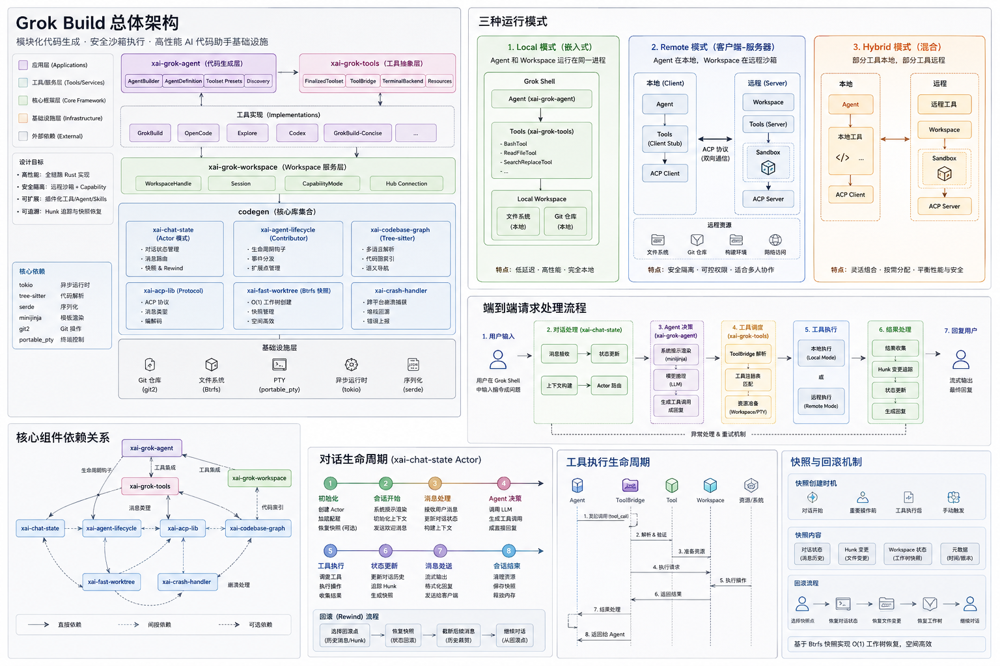

```
┌──────────────────────────────────────────────────────────────────────────────┐
│                              Grok Build 架构                                   │
├──────────────────────────────────────────────────────────────────────────────┤
│                                                                               │
│  ┌────────────────────────────────────────────────────────────────────────┐  │
│  │                         User Interface Layer                            │  │
│  │                    TUI (ratatui) │ Headless │ ACP                       │  │
│  └────────────────────────────────┬───────────────────────────────────────┘  │
│                                   │                                          │
│                                   ▼                                          │
│  ┌────────────────────────────────────────────────────────────────────────┐  │
│  │                          Agent Harness Layer                            │  │
│  │  ┌─────────────┐  ┌─────────────┐  ┌─────────────┐  ┌─────────────┐    │  │
│  │  │   Agent     │  │    Tool     │  │  Workspace  │  │   Session   │    │  │
│  │  │   Loop      │  │   System    │  │   Manager   │  │   State     │    │  │
│  │  │ (Actor)     │  │             │  │             │  │ (Compaction)│    │  │
│  │  └─────────────┘  └─────────────┘  └─────────────┘  └─────────────┘    │  │
│  └────────────────────────────────┬───────────────────────────────────────┘  │
│                                   │                                          │
│                                   ▼                                          │
│  ┌────────────────────────────────────────────────────────────────────────┐  │
│  │                          Runtime Layer                                  │  │
│  │  ┌─────────────┐  ┌─────────────┐  ┌─────────────┐  ┌─────────────┐    │  │
│  │  │   Tokio     │  │   Sandbox   │  │    MCP      │  │   Memory    │    │  │
│  │  │  (async)    │  │  (隔离执行)  │  │  Protocol   │  │   (记忆)    │    │  │
│  │  └─────────────┘  └─────────────┘  └─────────────┘  └─────────────┘    │  │
│  └────────────────────────────────────────────────────────────────────────┘  │
│                                                                               │
└──────────────────────────────────────────────────────────────────────────────┘
```

---

### 模块层次结构

```
grok-build/
├── build/                          # 构建工具
│   └── xai-proto-build             # Protobuf 代码生成
│
├── codegen/                        # 核心代码生成与运行时
│   ├── xai-acp-lib                 # ACP 协议库 (Agent-Client Protocol)
│   ├── xai-agent-lifecycle         # Agent 生命周期管理
│   ├── xai-chat-state              # 对话状态机 (Actor 模型)
│   │   ├── actor/                  # Actor 实现 (mod, mutations, queries, request_builder, state, tests)
│   │   ├── compaction_*.rs         # 上下文压缩
│   │   ├── persistence.rs          # 持久化 (Journal/SQLite)
│   │   └── types.rs                # 类型定义
│   ├── xai-codebase-graph          # 代码库图谱构建
│   ├── xai-crash-handler           # 崩溃处理与恢复
│   ├── xai-fast-worktree           # Git Worktree 快速切换
│   ├── xai-file-utils              # 文件操作工具
│   ├── xai-fsnotify                # 文件系统监控
│   ├── xai-gix-status              # Git 状态封装 (基于 gix)
│   ├── xai-grok-agent              # Agent Loop 主实现
│   ├── xai-grok-announcements      # 公告系统
│   ├── xai-grok-auth               # 认证授权
│   ├── xai-grok-config             # 配置管理
│   ├── xai-grok-config-types       # 配置类型定义
│   ├── xai-grok-env                # 环境变量管理
│   ├── xai-grok-hooks              # 生命周期钩子扩展
│   ├── xai-grok-http               # HTTP 客户端/服务器
│   ├── xai-grok-markdown           # Markdown 渲染
│   ├── xai-grok-markdown-core      # Markdown 核心解析
│   ├── xai-grok-mcp                # Model Context Protocol 支持
│   ├── xai-grok-memory             # 混合记忆系统
│   ├── xai-grok-mermaid            # Mermaid 图表生成
│   ├── xai-grok-models             # 模型接口封装
│   ├── xai-grok-pager              # 分页器 (TUI 渲染)
│   ├── xai-grok-pager-pty-harness  # PTY 分页器
│   ├── xai-grok-paths              # 路径工具
│   ├── xai-grok-plugin-marketplace # 插件市场
│   ├── xai-grok-sampler            # 采样器
│   ├── xai-grok-sampling-types     # 采样类型
│   ├── xai-grok-sandbox            # 进程隔离沙箱
│   ├── xai-grok-secrets            # 密钥管理
│   ├── xai-grok-shared             # 共享工具
│   ├── xai-grok-shell              # Shell 交互
│   ├── xai-grok-shell-base         # Shell 基础
│   ├── xai-grok-shell-session-support # Shell 会话支持
│   ├── xai-grok-subagent-resolution # 子 Agent 解析
│   ├── xai-grok-telemetry          # 遥测数据
│   ├── xai-grok-test-support       # 测试支持
│   ├── xai-grok-tools              # 工具系统 (注册/发现/执行)
│   ├── xai-grok-tools-api          # 工具 API
│   ├── xai-grok-update             # 更新检查
│   ├── xai-grok-version            # 版本管理
│   ├── xai-grok-voice              # 语音支持
│   ├── xai-grok-workspace          # 工作区管理 (文件/Git/权限)
│   ├── xai-grok-workspace-client   # 工作区客户端
│   ├── xai-grok-workspace-types    # 工作区类型定义
│   ├── xai-hooks-plugins-types     # Hook/Plugin 类型
│   ├── xai-hunk-tracker            # Hunk 追踪 (diff)
│   ├── xai-mixpanel                # Mixpanel 集成
│   ├── xai-prompt-queue            # Prompt 队列
│   ├── xai-ratatui-inline          # 内联 TUI 组件
│   ├── xai-ratatui-textarea        # TUI 文本域
│   ├── xai-sqlite-journal          # SQLite 日志
│   ├── xai-system-power            # 系统电源管理
│   ├── xai-token-estimation        # Token 估算
│   ├── xai-tracing-macros          # 追踪宏
│   ├── xai-tty-utils               # TTY 工具
│   ├── ptyctl                      # PTY 控制库
│   └── ptyctl-cli                  # PTY 控制 CLI
│
├── common/                         # 通用组件
│   ├── xai-circuit-breaker         # 熔断器
│   ├── xai-computer-hub-core       # Computer Hub 核心
│   ├── xai-computer-hub-mcp-adapter # MCP 适配器
│   ├── xai-computer-hub-sdk        # SDK
│   ├── xai-grok-compaction          # 压缩核心逻辑
│   ├── xai-interjection-core       # 插断核心
│   ├── xai-test-utils              # 测试工具
│   ├── xai-tool-protocol           # 工具协议
│   ├── xai-tool-runtime            # 工具运行时
│   ├── xai-tool-types              # 工具类型定义
│   └── xai-tracing                 # 追踪基础设施
│
└── third_party/                    # 第三方库
    ├── dagre_rust                  # 图布局算法
    ├── graphlib_rust               # 图数据结构
    ├── mermaid-to-svg              # Mermaid 转 SVG
    └── ordered_hashmap             # 有序 HashMap
```

---

### 核心模块

| 模块 | Crate | 职责 |
|------|-------|------|
| **Agent Loop** | `xai-grok-agent` | 基于 Actor 模型的对话状态管理 |
| **Tool System** | `xai-grok-tools` | 工具注册、发现、调度、执行 |
| **Workspace** | `xai-grok-workspace` | 文件操作、Git 集成、权限控制 |
| **Session State** | `xai-chat-state` | 会话状态、Compaction、持久化 |
| **Context Assembly** | `xai-chat-state/actor` | 系统提示词构建、请求组装 |
| **Sandbox** | `xai-grok-sandbox` | 进程隔离、安全执行 |
| **MCP** | `xai-grok-mcp` | Model Context Protocol 支持 |
| **Hooks** | `xai-grok-hooks` | Agent 生命周期钩子扩展 |

---

### 图示集 (Figures Showcase)

| 编号 | 图表 | 说明 |
|------|------|------|
| 01 | 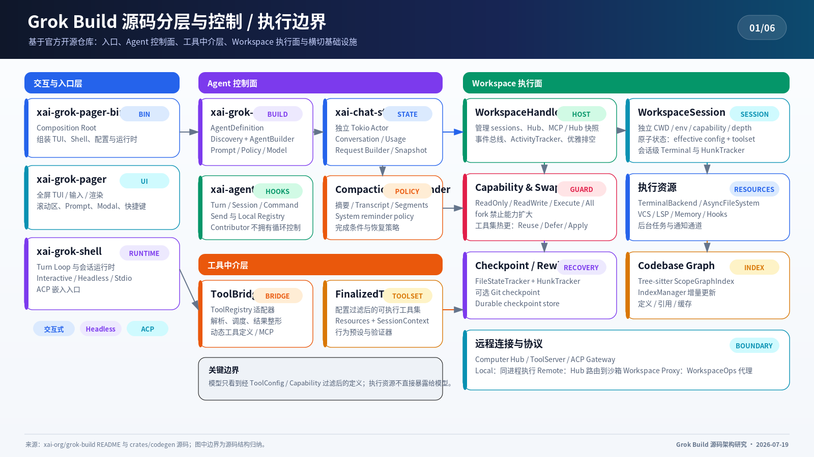 | 源码整体架构与模块关系 |
| 02 | 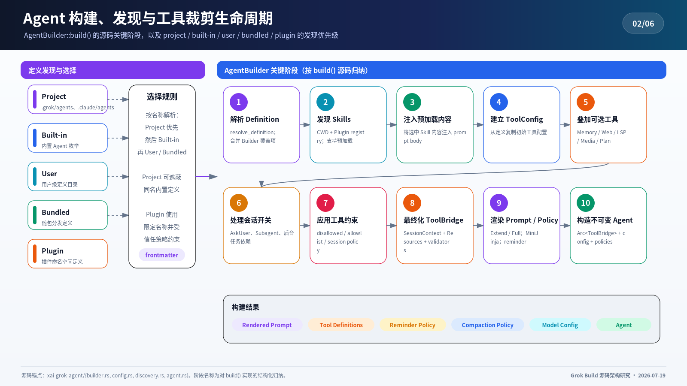 | Agent 启动与工具发现流程 |
| 03 | 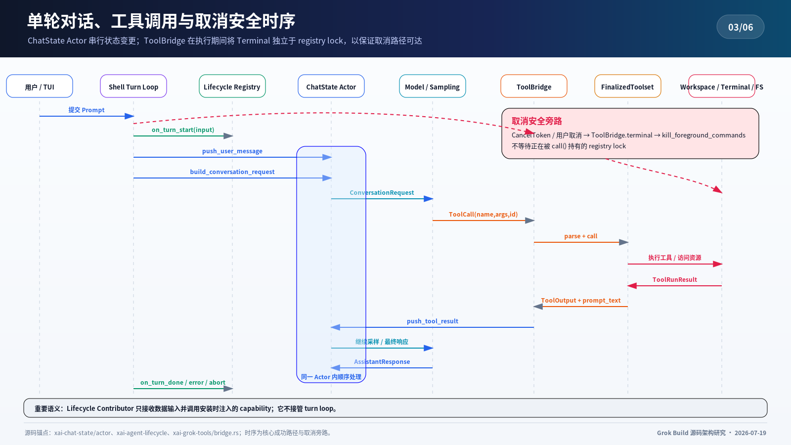 | 单轮对话与工具调用时序 |
| 04 | 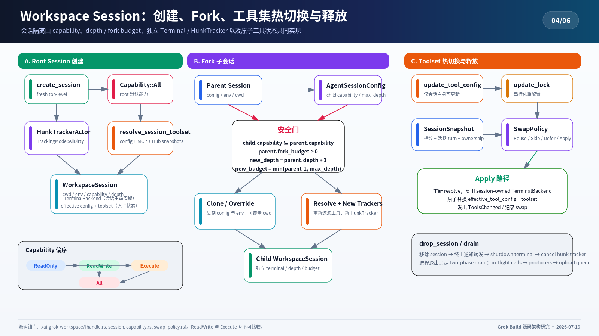 | 工作区与会话状态管理 |
| 05 | 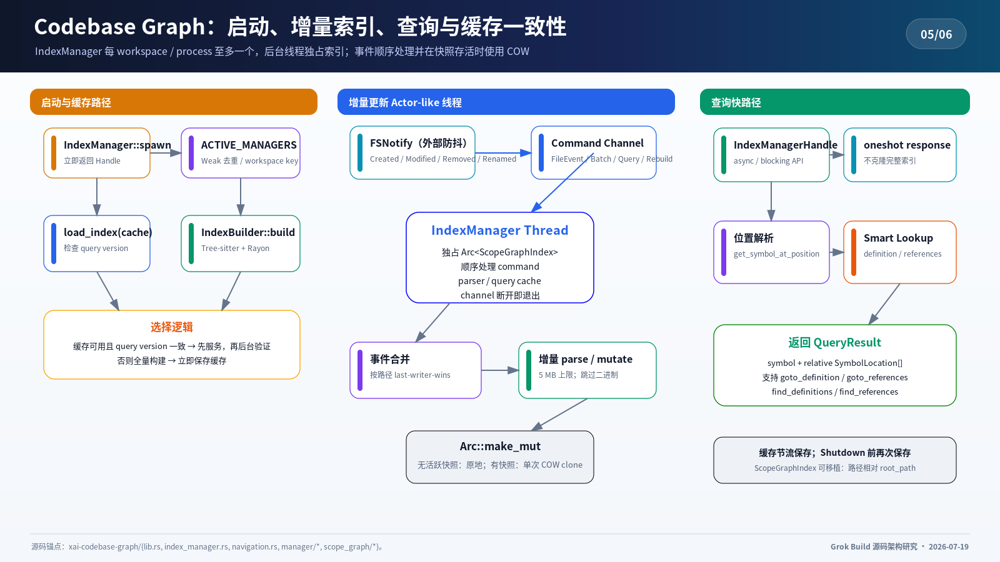 | 代码库图谱构建与使用 |
| 06 | 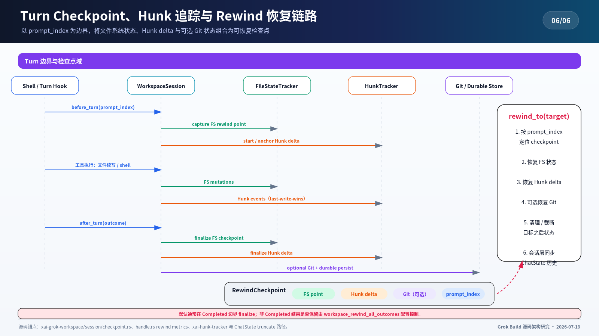 | 状态Checkpoint与回退机制 |
| 07 | 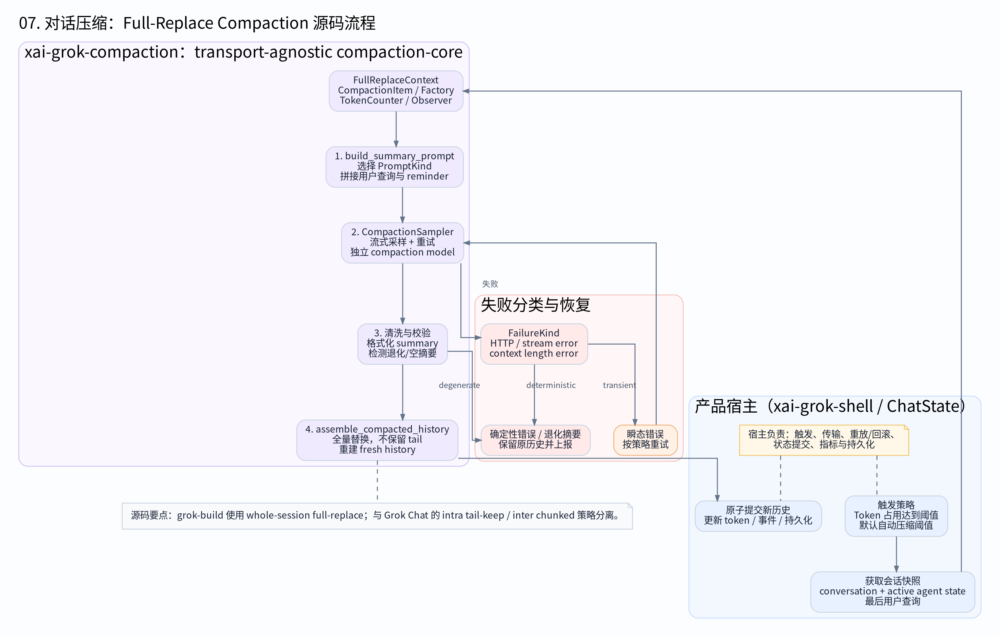 | 上下文压缩替换策略 |
| 08 | 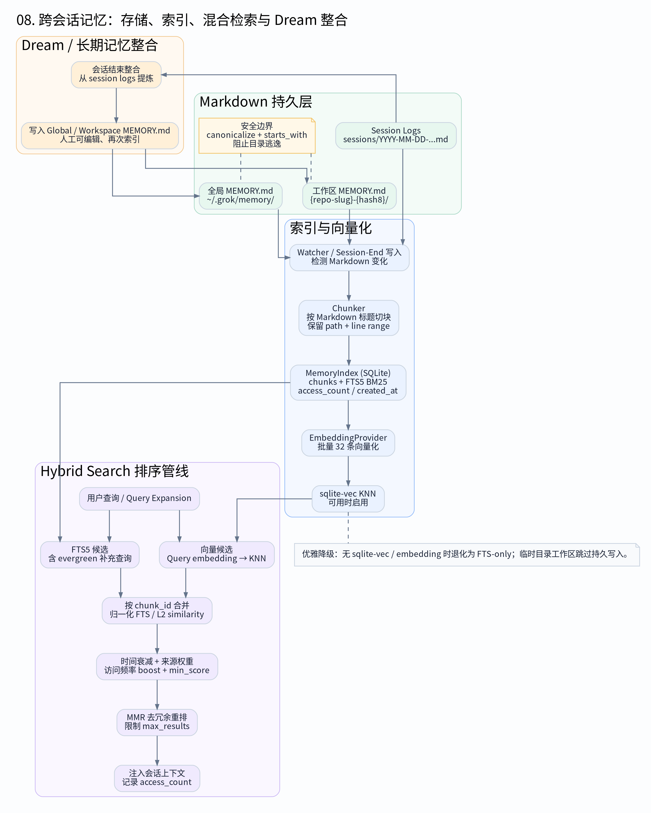 | 混合记忆与向量搜索 |
| 09 | 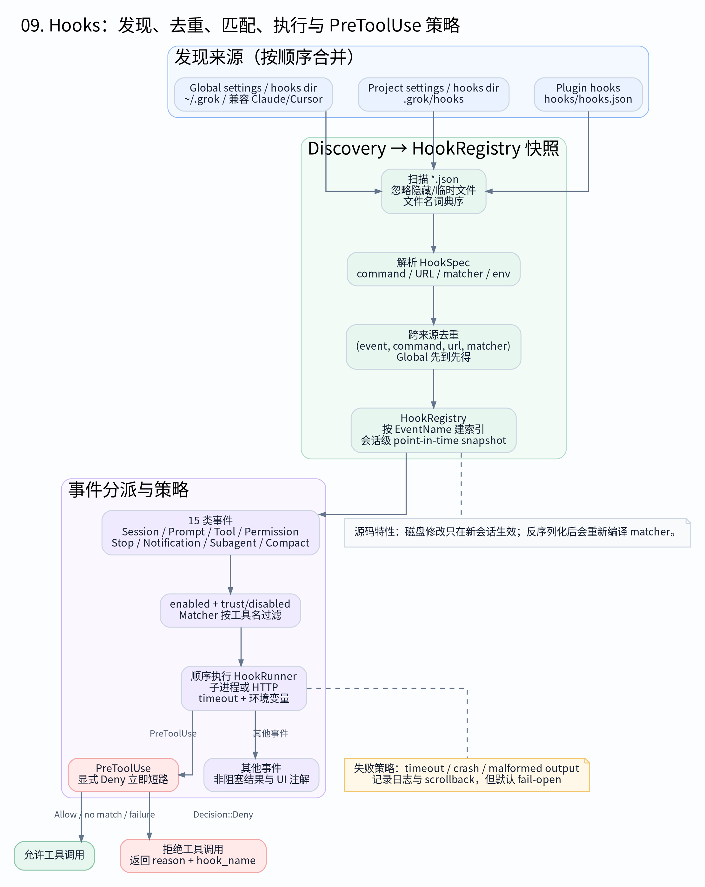 | Hooks 策略执行管道 |
| 10 | 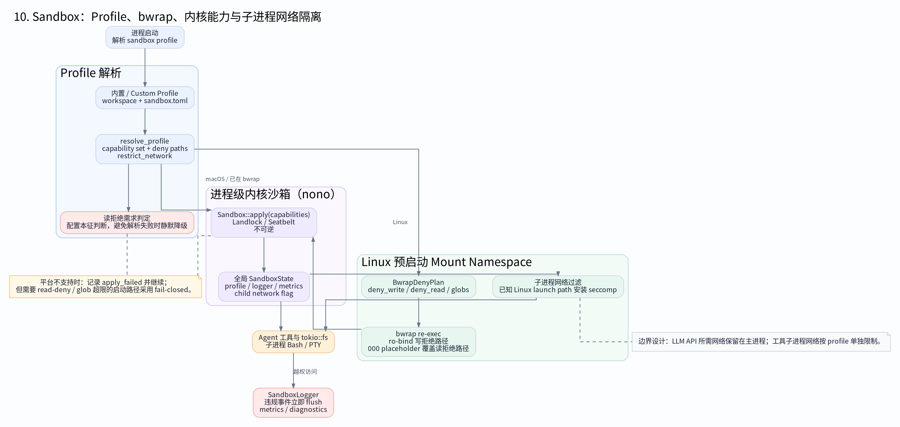 | 沙箱权限强制执行 |
| 11 | 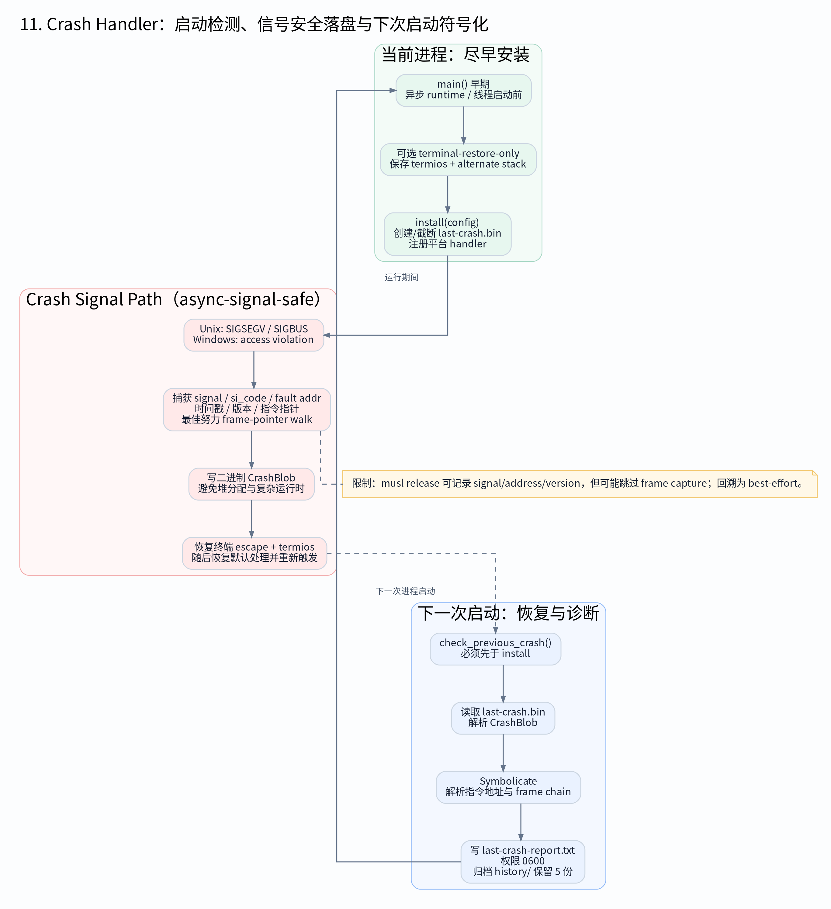 | 崩溃捕获与恢复生命周期 |
| 12 | 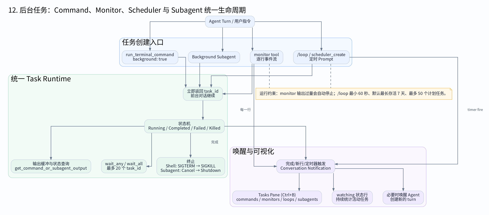 | 后台任务调度器 |
| 13 | 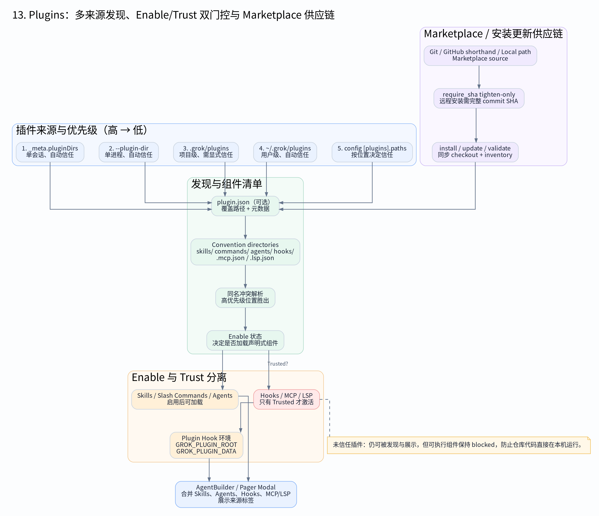 | 插件市场与信任模型 |

---

### 技术栈

| 技术 | 版本 | 用途 |
|------|------|------|
| **Rust** | edition 2024 | 核心语言，避免 GC 停顿 |
| **Tokio** | 1.x | 异步运行时 |
| **ratatui** | 0.29 | TUI 终端界面渲染 |
| **gix** | 0.83 | Git 仓库操作 |
| **tonic/prost** | 0.14 | gRPC 通信 |
| **moka** | 0.12 | 高性能缓存 |
| **minijinja** | 2.9 | 模板渲染 |

---

### 学习路径

#### 入门路径（推荐阅读顺序）

```
1. 源码架构 (01)     → 建立整体印象
      ↓
2. Agent 构建 (02)   → 理解启动流程
      ↓
3. Turn 时序 (03)    → 追踪请求全貌
      ↓
4. 工作区 (04)       → 掌握核心机制 ⭐
      ↓
5. 代码库图谱 (05)   → 理解上下文
      ↓
6. Checkpoint (06)   → 状态管理
      ↓
7. Compaction (07)   → 上下文压缩
      ↓
8. 混合记忆 (08)     → 记忆系统
      ↓
9. Hooks 管道 (09)   → 扩展机制
      ↓
10. 沙箱执行 (10)    → 安全机制
```

#### 专题路径

| 专题 | 关联图表 |
|------|----------|
| **Actor 并发模型** | 02, 03, 04 |
| **工具系统设计** | 02, 03, 09 |
| **安全沙箱** | 10, 04 |
| **上下文压缩** | 06, 07, 05 |
| **崩溃恢复** | 11, 12 |
| **插件生态** | 09, 13 |

---

### 源码信息

| 项目 | 值 |
|------|---|
| **上游仓库** | https://github.com/xai-org/grok-build |
| **当前版本** | `7cfcb20d2b50b0d18801a6c0af2e401c0e060894` |
| **分析日期** | 2026-07-19 |
| **Crate 数量** | 83 |
| **源码规模** | ~500K LOC |

> 本项目为**个人学习笔记**，不代表 Grok Build 官方立场。源码更新后，旧文档可能不再反映最新实现。

---

### 快速开始

#### 克隆项目

```bash
git clone https://github.com/nudt-eddie/learn-grok-build.git
cd learn-grok-build
```

#### 添加源码（Submodule）

```bash
git submodule add https://github.com/xai-org/grok-build.git source
cd source
git checkout 7cfcb20d2b50b0d18801a6c0af2e401c0e060894
```

#### 构建验证

```bash
cd source
cargo build --release
```

---

### 项目原则

1. **行为优先于实现** - 关注"做什么"和"为什么"，而非逐行代码
2. **关联固定版本** - 所有结论关联到特定 commit，便于回溯
3. **可复现验证** - 关键机制提供最小可验证实验
4. **区分事实与推断** - 明确标注源码事实 vs 个人推断
5. **安全脱敏** - 不包含密钥、认证信息或敏感日志

---

### 贡献指南

欢迎提交 PR 完善文档！

```bash
# 1. Fork 本仓库
# 2. 创建特性分支
git checkout -b docs/improve-agent-loop

# 3. 编辑文档
# 4. 提交 (引用对应源码 commit)
git commit -m "docs: 补充 Agent Loop 重试机制说明"

# 5. Push 并创建 PR
git push origin docs/improve-agent-loop
```

---

### License

本项目基于学习目的创建，内容为个人对源码的理解和分析，基于 MIT 协议开源。

Grok Build 源码基于 Apache-2.0 许可证。

---

<p align="center">
  <i>Built with for the Rust community</i><br>
  <a href="https://github.com/nudt-eddie/learn-grok-build">GitHub</a>
</p>

---

## English

### Project Overview

This project provides a systematic analysis of [Grok Build](https://github.com/xai-org/grok-build) source code, exploring how a production-grade Coding Agent organically combines modules such as model inference, context assembly, tool systems, workspace management, and permission control through **source code maps**, **call chain tracing**, **sequence diagram analysis**, and **reproducible experiments**.

#### Core Research Questions

| Layer | Research Question |
|-------|-------------------|
| **Request Entry** | How do user requests enter the Agent Loop? |
| **Context Assembly** | How is the system prompt constructed? How is message history managed? |
| **Model Interaction** | How are Tool Calls parsed? How are streaming responses handled? |
| **Tool Execution** | How are tools registered, approved, executed, and results returned? |
| **Workspace** | How do file modifications, Git operations, and Checkpoints collaborate? |
| **State Management** | How do Session, Compaction, and Memory manage state? |
| **Security Isolation** | How do Sandbox and permission systems limit risk boundaries? |
| **Extension Mechanisms** | How do Skills, Plugins, Hooks, and MCP extend the Harness? |

---

### Architecture Overview


```
┌──────────────────────────────────────────────────────────────────────────────┐
│                              Grok Build Architecture                           │
├──────────────────────────────────────────────────────────────────────────────┤
│                                                                               │
│  ┌────────────────────────────────────────────────────────────────────────┐  │
│  │                         User Interface Layer                            │  │
│  │                    TUI (ratatui) │ Headless │ ACP                       │  │
│  └────────────────────────────────┬───────────────────────────────────────┘  │
│                                   │                                          │
│                                   ▼                                          │
│  ┌────────────────────────────────────────────────────────────────────────┐  │
│  │                          Agent Harness Layer                            │  │
│  │  ┌─────────────┐  ┌─────────────┐  ┌─────────────┐  ┌─────────────┐    │  │
│  │  │   Agent     │  │    Tool     │  │  Workspace  │  │   Session   │    │  │
│  │  │   Loop      │  │   System    │  │   Manager   │  │   State     │    │  │
│  │  │ (Actor)     │  │             │  │             │  │ (Compaction)│    │  │
│  │  └─────────────┘  └─────────────┘  └─────────────┘  └─────────────┘    │  │
│  └────────────────────────────────┬───────────────────────────────────────┘  │
│                                   │                                          │
│                                   ▼                                          │
│  ┌────────────────────────────────────────────────────────────────────────┐  │
│  │                          Runtime Layer                                  │  │
│  │  ┌─────────────┐  ┌─────────────┐  ┌─────────────┐  ┌─────────────┐    │  │
│  │  │   Tokio     │  │   Sandbox   │  │    MCP      │  │   Memory    │    │  │
│  │  │  (async)    │  │ (Isolated)  │  │  Protocol   │  │   (Memory)  │    │  │
│  │  └─────────────┘  └─────────────┘  └─────────────┘  └─────────────┘    │  │
│  └────────────────────────────────────────────────────────────────────────┘  │
│                                                                               │
└──────────────────────────────────────────────────────────────────────────────┘
```

---

### Module Hierarchy

```
grok-build/
├── build/                          # Build tools
│   └── xai-proto-build             # Protobuf code generation
│
├── codegen/                        # Core code generation & runtime
│   ├── xai-acp-lib                 # ACP Protocol Library
│   ├── xai-agent-lifecycle         # Agent lifecycle management
│   ├── xai-chat-state              # Chat state machine (Actor model)
│   │   ├── actor/                  # Actor impl (mod, mutations, queries, state)
│   │   ├── compaction_*.rs         # Context compaction
│   │   ├── persistence.rs          # Persistence (Journal/SQLite)
│   │   └── types.rs                # Type definitions
│   ├── xai-codebase-graph          # Codebase graph construction
│   ├── xai-crash-handler           # Crash handling & recovery
│   ├── xai-fast-worktree           # Git worktree fast switching
│   ├── xai-file-utils              # File operation utilities
│   ├── xai-fsnotify                # Filesystem monitoring
│   ├── xai-gix-status              # Git status wrapper (gix-based)
│   ├── xai-grok-agent              # Agent Loop main implementation
│   ├── xai-grok-announcements      # Announcement system
│   ├── xai-grok-auth               # Authentication & authorization
│   ├── xai-grok-config             # Configuration management
│   ├── xai-grok-config-types       # Config type definitions
│   ├── xai-grok-env                # Environment variable management
│   ├── xai-grok-hooks              # Lifecycle hook extensions
│   ├── xai-grok-http               # HTTP client/server
│   ├── xai-grok-markdown           # Markdown rendering
│   ├── xai-grok-markdown-core      # Markdown core parser
│   ├── xai-grok-mcp                # Model Context Protocol support
│   ├── xai-grok-memory             # Hybrid memory system
│   ├── xai-grok-mermaid            # Mermaid diagram generation
│   ├── xai-grok-models             # Model interface wrapper
│   ├── xai-grok-pager              # Pager (TUI rendering)
│   ├── xai-grok-pager-pty-harness  # PTY pager harness
│   ├── xai-grok-paths              # Path utilities
│   ├── xai-grok-plugin-marketplace # Plugin marketplace
│   ├── xai-grok-sampler            # Sampler
│   ├── xai-grok-sampling-types     # Sampling types
│   ├── xai-grok-sandbox            # Process isolation sandbox
│   ├── xai-grok-secrets            # Secret management
│   ├── xai-grok-shared             # Shared utilities
│   ├── xai-grok-shell              # Shell interaction
│   ├── xai-grok-shell-base         # Shell base
│   ├── xai-grok-shell-session-support # Shell session support
│   ├── xai-grok-subagent-resolution # Subagent resolution
│   ├── xai-grok-telemetry          # Telemetry
│   ├── xai-grok-test-support       # Test support
│   ├── xai-grok-tools              # Tool system (register/discover/execute)
│   ├── xai-grok-tools-api          # Tool API
│   ├── xai-grok-update             # Update checker
│   ├── xai-grok-version            # Version management
│   ├── xai-grok-voice              # Voice support
│   ├── xai-grok-workspace          # Workspace management (file/Git/permission)
│   ├── xai-grok-workspace-client   # Workspace client
│   ├── xai-grok-workspace-types    # Workspace type definitions
│   ├── xai-hooks-plugins-types     # Hook/Plugin types
│   ├── xai-hunk-tracker            # Hunk tracking (diff)
│   ├── xai-mixpanel                # Mixpanel integration
│   ├── xai-prompt-queue            # Prompt queue
│   ├── xai-ratatui-inline          # Inline TUI components
│   ├── xai-ratatui-textarea        # TUI textarea
│   ├── xai-sqlite-journal          # SQLite journal
│   ├── xai-system-power            # System power management
│   ├── xai-token-estimation        # Token estimation
│   ├── xai-tracing-macros          # Tracing macros
│   ├── xai-tty-utils               # TTY utilities
│   ├── ptyctl                      # PTY control library
│   └── ptyctl-cli                  # PTY control CLI
│
├── common/                         # Common components
│   ├── xai-circuit-breaker         # Circuit breaker
│   ├── xai-computer-hub-core       # Computer Hub core
│   ├── xai-computer-hub-mcp-adapter # MCP adapter
│   ├── xai-computer-hub-sdk        # SDK
│   ├── xai-grok-compaction          # Compaction core logic
│   ├── xai-interjection-core       # Interjection core
│   ├── xai-test-utils              # Test utilities
│   ├── xai-tool-protocol           # Tool protocol
│   ├── xai-tool-runtime            # Tool runtime
│   ├── xai-tool-types              # Tool type definitions
│   └── xai-tracing                 # Tracing infrastructure
│
└── third_party/                    # Third-party libraries
    ├── dagre_rust                  # Graph layout algorithm
    ├── graphlib_rust               # Graph data structure
    ├── mermaid-to-svg              # Mermaid to SVG
    └── ordered_hashmap             # Ordered HashMap
```

---

### Core Modules

| Module | Crate | Responsibility |
|--------|-------|----------------|
| **Agent Loop** | `xai-grok-agent` | Actor-based conversation state management |
| **Tool System** | `xai-grok-tools` | Tool registration, discovery, scheduling, execution |
| **Workspace** | `xai-grok-workspace` | File operations, Git integration, permission control |
| **Session State** | `xai-chat-state` | Session state, Compaction, persistence |
| **Context Assembly** | `xai-chat-state/actor` | System prompt construction, request assembly |
| **Sandbox** | `xai-grok-sandbox` | Process isolation, secure execution |
| **MCP** | `xai-grok-mcp` | Model Context Protocol support |
| **Hooks** | `xai-grok-hooks` | Agent lifecycle hook extensions |

---

### Figures Showcase

| # | Figure | Description |
|---|--------|-------------|
| 01 |  | Source code architecture and module relationships |
| 02 |  | Agent startup and tool discovery flow |
| 03 |  | Single-turn dialogue and tool invocation sequence |
| 04 |  | Workspace and session state management |
| 05 |  | Codebase graph construction and usage |
| 06 |  | State checkpoint and rewind mechanism |
| 07 |  | Context compression replacement strategy |
| 08 |  | Hybrid memory and vector search |
| 09 |  | Hooks policy execution pipeline |
| 10 |  | Sandbox permission enforcement |
| 11 |  | Crash capture and recovery lifecycle |
| 12 |  | Background task scheduler |
| 13 |  | Plugin marketplace and trust model |

---

### Tech Stack

| Technology | Version | Purpose |
|------------|---------|---------|
| **Rust** | edition 2024 | Core language, avoiding GC pauses |
| **Tokio** | 1.x | Async runtime |
| **ratatui** | 0.29 | TUI terminal rendering |
| **gix** | 0.83 | Git repository operations |
| **tonic/prost** | 0.14 | gRPC communication |
| **moka** | 0.12 | High-performance caching |
| **minijinja** | 2.9 | Template rendering |

---

### Learning Path

#### Beginner Path (Recommended Reading Order)

```
1. Source Architecture (01)   → Build overall understanding
      ↓
2. Agent Build (02)           → Understand startup process
      ↓
3. Turn Sequence (03)         → Trace request flow
      ↓
4. Workspace (04)             → Master core mechanism ⭐
      ↓
5. Codebase Graph (05)        → Understand context
      ↓
6. Checkpoint (06)            → State management
      ↓
7. Compaction (07)            → Context compression
      ↓
8. Hybrid Memory (08)         → Memory system
      ↓
9. Hooks Pipeline (09)        → Extension mechanism
      ↓
10. Sandbox (10)              → Security mechanism
```

#### Topic-Based Path

| Topic | Related Figures |
|-------|-----------------|
| **Actor Concurrency Model** | 02, 03, 04 |
| **Tool System Design** | 02, 03, 09 |
| **Security Sandbox** | 10, 04 |
| **Context Compression** | 06, 07, 05 |
| **Crash Recovery** | 11, 12 |
| **Plugin Ecosystem** | 09, 13 |

---

### Source Code Information

| Item | Value |
|------|-------|
| **Upstream Repository** | https://github.com/xai-org/grok-build |
| **Current Version** | `7cfcb20d2b50b0d18801a6c0af2e401c0e060894` |
| **Analysis Date** | 2026-07-19 |
| **Crate Count** | 83 |
| **Code Scale** | ~500K LOC |

> This project is a **personal study note** and does not represent the official position of Grok Build. After source code updates, old documentation may no longer reflect the latest implementation.

---

### Quick Start

#### Clone the Project

```bash
git clone https://github.com/nudt-eddie/learn-grok-build.git
cd learn-grok-build
```

#### Add Source Code (Submodule)

```bash
git submodule add https://github.com/xai-org/grok-build.git source
cd source
git checkout 7cfcb20d2b50b0d18801a6c0af2e401c0e060894
```

#### Build Verification

```bash
cd source
cargo build --release
```

---

### Project Principles

1. **Behavior over Implementation** - Focus on "what" and "why", not line-by-line code
2. **Pin to Specific Versions** - All conclusions linked to specific commits for traceability
3. **Reproducible Verification** - Key mechanisms provide minimal verifiable experiments
4. **Distinguish Facts from Inferences** - Clearly mark source code facts vs personal inferences
5. **Security Sanitization** - No keys, authentication info, or sensitive logs included

---

### Contributing Guide

Pull requests to improve documentation are welcome!

```bash
# 1. Fork this repository
# 2. Create a feature branch
git checkout -b docs/improve-agent-loop

# 3. Edit documentation
# 4. Commit (reference corresponding source code commit)
git commit -m "docs: Add Agent Loop retry mechanism explanation"

# 5. Push and create PR
git push origin docs/improve-agent-loop
```

---

### License

This project was created for learning purposes, containing personal understanding and analysis of the source code, open-sourced under the MIT license.

Grok Build source code is licensed under Apache-2.0.

---

<p align="center">
  <i>Built with for the Rust community</i><br>
  <a href="https://github.com/nudt-eddie/learn-grok-build">GitHub</a>
</p>