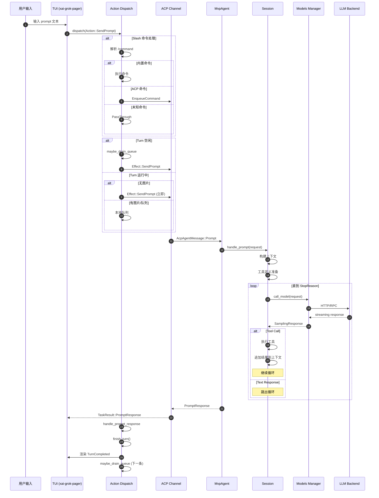
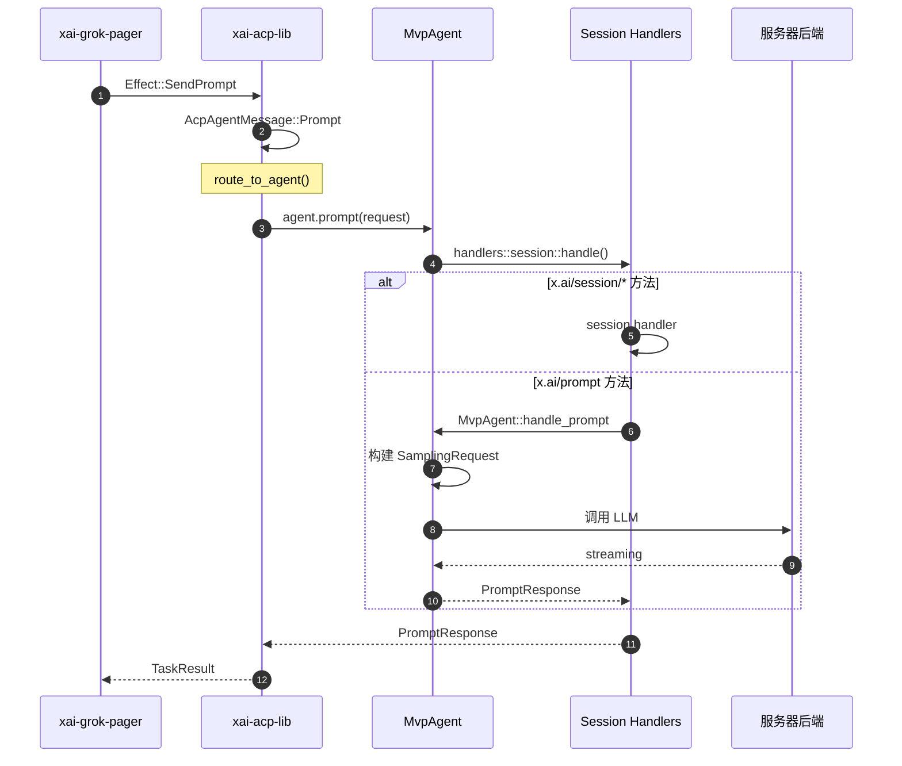
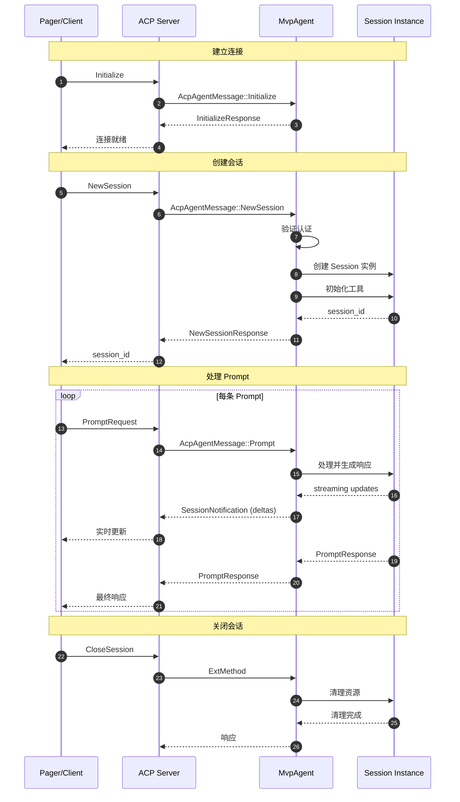
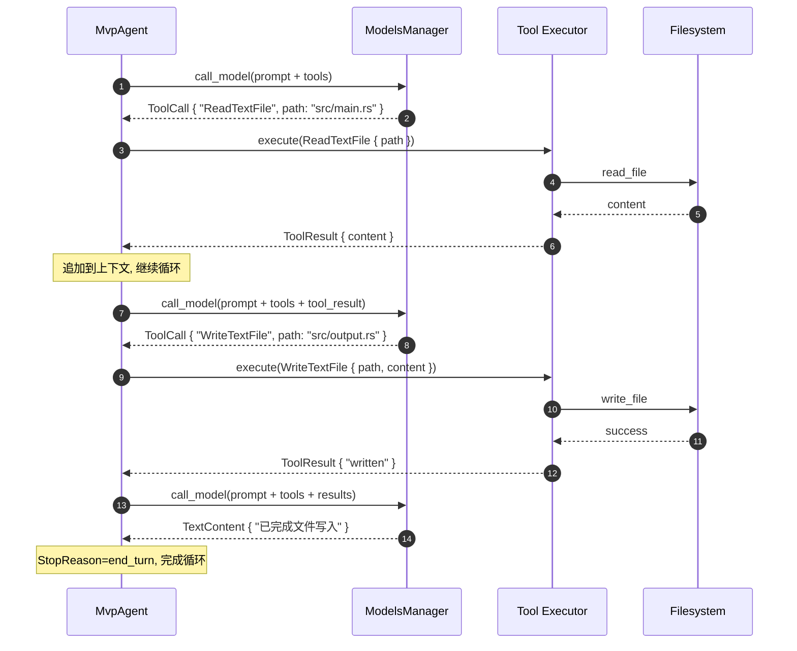

# Grok Build 请求完整调用链分析

## 目录

- [1. 输入入口 (Input Entry Points)](#1-输入入口-input-entry-points)
- [2. 请求路由 (Request Routing)](#2-请求路由-request-routing)
- [3. Agent 处理 (Agent Processing)](#3-agent-处理-agent-processing)
- [4. 模型调用 (Model Invocation)](#4-模型调用-model-invocation)
- [5. 响应生成 (Response Generation)](#5-响应生成-response-generation)
- [6. 时序图 (Sequence Diagrams)](#6-时序图-sequence-diagrams)

---

## 1. 输入入口 (Input Entry Points)

Grok Build 支持多种输入方式来发起请求：

### 1.1 TUI 交互入口

| 入口 | 源码位置 | 描述 |
|------|----------|------|
| Prompt 输入 | `xai-grok-pager/src/app/agent_view/prompt.rs` | 用户在终端输入文本 |
| Slash 命令 | `xai-grok-pager/src/slash/mod.rs` | 以 `/` 开头的内置命令 |
| 热键绑定 | `xai-grok-pager/src/input/*.rs` | Ctrl+C, Ctrl+Z 等快捷键 |
| Follow-up Chips | `xai-grok-pager/src/app/agent_view/` | 服务器建议的快速回复 |
| Bash 命令 | `xai-grok-pager/src/app/dispatch/prompt.rs` | 以 `!` 开头的直接命令 |

### 1.2 启动参数入口

```rust
// xai-grok-pager-bin/src/main.rs
// 启动时直接传递 prompt
grok "explain this code"
grok --resume <session_id>
grok --chat "interactive prompt"
```

### 1.3 ACP 协议入口

通过 Agent Client Protocol (ACP) 接收远程请求：

| 消息类型 | 源码位置 | 描述 |
|----------|----------|------|
| `ExtRequest` | `xai-acp-lib/src/message.rs` | 扩展方法请求 |
| `ExtNotification` | `xai-acp-lib/src/message.rs` | 扩展通知 |
| `SessionNotification` | `xai-acp-lib/src/message.rs` | 会话更新通知 |

---

## 2. 请求路由 (Request Routing)

### 2.1 TUI 事件分发

```
┌─────────────────────────────────────────────────────────────┐
│                     Input Handling                          │
│  xai-grok-pager/src/app/input/                             │
└─────────────────────────────────────────────────────────────┘
                              │
                              ▼
┌─────────────────────────────────────────────────────────────┐
│                   InputEvent → Action                       │
│  xai-grok-pager/src/app/input/                             │
│  - KeyEvent → Action::SendPrompt                           │
│  - MouseEvent → Action::*                                  │
│  - ResizeEvent → Action::*                                 │
└─────────────────────────────────────────────────────────────┘
                              │
                              ▼
┌─────────────────────────────────────────────────────────────┐
│                      Action Dispatch                        │
│  xai-grok-pager/src/app/dispatch/router.rs                 │
│                                                             │
│  pub fn dispatch(action: Action, app: &mut AppView)        │
└─────────────────────────────────────────────────────────────┘
```

### 2.2 核心路由逻辑

**关键文件**: `xai-grok-pager/src/app/dispatch/router.rs`

```rust
pub(crate) fn dispatch(action: Action, app: &mut AppView) -> Vec<Effect> {
    match action {
        // 会话管理
        Action::NewSession => dispatch_new_session(app),
        Action::LoadSession(id, cwd, chat) => dispatch_load_session(...),
        Action::ExitSession => dispatch_exit_session(app),
        
        // Prompt 处理核心路径
        Action::SendPrompt(text) => dispatch_send_prompt(app, text),
        Action::SubmitFollowUp(text) => dispatch_send_prompt_inner(...),
        Action::SendBashCommand(cmd) => dispatch_send_bash_command(...),
        
        // 交互命令
        Action::Interject { text, images } => dispatch_interject(...),
        Action::SendPromptNow { text, images } => dispatch_send_prompt_now(...),
        
        // ...
    }
}
```

### 2.3 Prompt 路由决策

```
dispatch_send_prompt(text)
         │
         ├──► Reconnect 挂起? ──► 显示 Toast
         │
         ├──► 需要项目选择器? ──► 打开项目问题对话框
         │
         ├──► 以 `/` 开头? ──► Slash 命令解析
         │         │
         │         ├──► 内置命令 ──► 执行 CommandResult
         │         ├──► ACP 命令 ──► EnqueueCommand
         │         └──► 未知命令 ──► PassThrough 到模型
         │
         ├──► 退出别名? (exit/quit/:q) ──► 退出会话
         │
         ├──► Turn 运行中 + 图片? ──► 本地队列
         │
         ├──► Turn 运行中 + 无图片? ──► 立即服务器发送
         │                          └──► Effect::SendPrompt
         │
         └──► Idle 状态? ──► 本地队列 + maybe_drain_queue
```

### 2.4 Effect 类型

**关键文件**: `xai-grok-pager/src/app/actions.rs`

```rust
pub enum Effect {
    // 核心 Prompt 效果
    SendPrompt {
        agent_id: AgentId,
        session_id: acp::SessionId,
        text: String,
        prompt_id: String,
        skill_token_ranges: Vec<Range<usize>>,
    },
    SendBashCommand { agent_id, session_id, command, prompt_id },
    
    // 会话管理效果
    NewSession { chat_mode: bool },
    LoadSession { session_id, cwd, chat_mode },
    
    // 模型交互效果
    SwitchModel { agent_id, session_id, model_id, effort },
    FetchPromptSuggestion { agent_id, generation, model, session_id },
    
    // MCP/工具效果
    UpsertMcpServer { agent_id, session_id, name, config },
    HooksAction { agent_id, session_id, action },
    
    // ...
}
```

---

## 3. Agent 处理 (Agent Processing)

### 3.1 ACP Agent 实现

**关键文件**: `xai-grok-shell/src/agent/mvp_agent/acp_agent.rs`

```rust
#[async_trait::async_trait(?Send)]
impl acp::Agent for MvpAgent {
    async fn initialize(&self, arguments: acp::InitializeRequest) 
        -> Result<acp::InitializeResponse, acp::Error> { ... }
    
    async fn new_session(&self, request: acp::NewSessionRequest) 
        -> Result<acp::NewSessionResponse, acp::Error> { ... }
    
    async fn load_session(&self, request: acp::LoadSessionRequest) 
        -> Result<acp::LoadSessionResponse, acp::Error> { ... }
    
    async fn prompt(&self, request: acp::PromptRequest) 
        -> Result<acp::PromptResponse, acp::Error> { ... }
    
    async fn cancel(&self, request: acp::CancelNotification) 
        -> Result<(), acp::Error> { ... }
    
    async fn set_session_mode(&self, request: acp::SetSessionModeRequest) 
        -> Result<acp::SetSessionModeResponse, acp::Error> { ... }
    
    async fn ext_method(&self, request: acp::ExtRequest) 
        -> Result<acp::ExtResponse, acp::Error> { ... }
    
    async fn ext_notification(&self, request: acp::ExtNotification) 
        -> Result<(), acp::Error> { ... }
}
```

### 3.2 ACP 消息定义

**关键文件**: `xai-acp-lib/src/message.rs`

```rust
// Agent 接收的消息
pub enum AcpAgentMessage {
    Initialize(AcpArgs<acp::InitializeRequest>),
    Authenticate(AcpArgs<acp::AuthenticateRequest>),
    NewSession(AcpArgs<acp::NewSessionRequest>),
    LoadSession(AcpArgs<acp::LoadSessionRequest>),
    SetSessionMode(AcpArgs<acp::SetSessionModeRequest>),
    Prompt(AcpArgs<acp::PromptRequest>),        // 核心: 处理用户 prompt
    Cancel(AcpArgs<acp::CancelNotification>),
    ExtMethod(AcpArgs<acp::ExtRequest>),
    ExtNotification(AcpArgs<acp::ExtNotification>),
    SetSessionModel(AcpArgs<acp::SetSessionModelRequest>),
}
```

### 3.3 Session 管理

**关键文件**: `xai-grok-shell/src/agent/mvp_agent/session_lifecycle.rs`

```rust
pub struct MvpAgent {
    pub sessions: Arc<RefCell<HashMap<acp::SessionId, Arc<Session>>>>,
    pub models_manager: Arc<ModelsManager>,
    pub auth_manager: Arc<AuthManager>,
    // ...
}

impl MvpAgent {
    pub async fn create_session(&self, request: &NewSessionRequest) -> Result<SessionId> {
        // 1. 验证认证
        // 2. 创建 Session 实例
        // 3. 初始化工具系统
        // 4. 返回 session_id
    }
    
    pub async fn handle_prompt(&self, session: &Session, request: &PromptRequest) 
        -> Result<PromptResponse> {
        // 核心 prompt 处理逻辑
    }
}
```

### 3.4 会话状态机

```
┌──────────────────────────────────────────────────────────────┐
│                      Session State Machine                   │
└──────────────────────────────────────────────────────────────┘

Created ──► Active ──► TurnRunning ──► TurnCancelling ──► Active
                │            │               │
                │            ▼               ▼
                │       (模型调用)      (取消完成)
                │
                ▼
            Closing ──► Closed
```

---

## 4. 模型调用 (Model Invocation)

### 4.1 模型管理器

**关键文件**: `xai-grok-shell/src/agent/models.rs`

```rust
pub struct ModelsManager {
    pub config: ModelConfig,
    pub cache: ModelCache,
    pub sampling: SamplingManager,
}

impl ModelsManager {
    pub async fn select_model(&self, session: &Session, model_id: Option<&str>) 
        -> Result<ModelHandle> {
        // 1. 解析模型请求
        // 2. 检查可用性/配额
        // 3. 返回模型句柄
    }
    
    pub async fn call_model(&self, request: &SamplingRequest) 
        -> Result<SamplingResponse> {
        // 调用后端模型 API
    }
}
```

### 4.2 采样请求构建

**关键文件**: `xai-grok-shell/src/sampling/`

```rust
pub struct SamplingRequest {
    pub model: ModelId,
    pub system_prompt: String,
    pub messages: Vec<Message>,
    pub tools: Vec<ToolDefinition>,
    pub temperature: Option<f32>,
    pub max_tokens: Option<u32>,
    pub reasoning_effort: Option<ReasoningEffort>,
}

pub struct SamplingResponse {
    pub content: Vec<ContentBlock>,
    pub stop_reason: StopReason,
    pub usage: Usage,
    pub model: String,
}
```

### 4.3 上下文管理

**关键文件**: `xai-grok-chat-state/src/`

```rust
pub struct ConversationTranscript {
    pub messages: Vec<Message>,
    pub compaction_state: CompactionState,
}

impl ConversationTranscript {
    pub fn build_context(&self, max_tokens: u64) -> CompactedContext {
        // 1. 计算当前 token 数
        // 2. 决定是否需要压缩
        // 3. 构建摘要
        // 4. 返回压缩后的上下文
    }
}
```

### 4.4 工具调用流程

```
User Prompt
     │
     ▼
┌─────────────────────────────────────────────────────────────┐
│                    Model Inference                          │
└─────────────────────────────────────────────────────────────┘
     │
     ▼
┌─────────────────────────────────────────────────────────────┐
│                Tool Call Decision                           │
│  model.response.content.iter().find(|b| matches!(b,       │
│      ContentBlock::ToolUse(_)))                            │
└─────────────────────────────────────────────────────────────┘
     │
     ├──► 无 Tool Call ──► 返回最终响应
     │
     └──► 有 Tool Call ──► 执行工具
                        │
                        ├──► ReadTextFile ──► 读取文件
                        ├──► WriteTextFile ──► 写入文件
                        ├──► TerminalCreate ──► 创建终端
                        ├──► Bash ──► 执行命令
                        └──► MCP ──► MCP 服务器调用
                              │
                              ▼
                        ┌─────────────────────────────────┐
                        │ 工具结果追加到上下文             │
                        └─────────────────────────────────┘
                              │
                              ▼
                        ┌─────────────────────────────────┐
                        │  循环: 再次调用模型              │
                        └─────────────────────────────────┘
```

---

## 5. 响应生成 (Response Generation)

### 5.1 Turn 完成处理

**关键文件**: `xai-grok-pager/src/app/dispatch/prompt.rs`

```rust
pub(super) fn handle_prompt_response(
    app: &mut AppView,
    agent_id: AgentId,
    result: Result<acp::PromptResponse, String>,
    http_status: Option<u16>,
    prompt_id: Option<String>,
) -> Vec<Effect> {
    // 1. 验证 prompt_id 匹配
    // 2. 处理取消/错误状态
    // 3. 清理 in_flight_prompt
    // 4. finish_turn(): 重置状态
    // 5. 推送 TurnCompleted/TurnFailed 事件
    // 6. 处理配额限制/认证失败
    // 7. 触发队列排水
}
```

### 5.2 流式更新处理

**关键文件**: `xai-grok-pager/src/app/acp_handler/`

```rust
// 流式 delta 路由
pub fn handle_session_notification(
    app: &mut AppView,
    agent_id: AgentId,
    update: acp::SessionUpdate,
) -> Vec<Effect> {
    match update {
        SessionUpdate::ContentBlock_delta(d) => {
            // 增量文本更新
            agent.scrollback.append_delta(delta);
        }
        SessionUpdate::ContentBlock_start(b) => {
            // 开始新的内容块
        }
        SessionUpdate::ToolUse(t) => {
            // 工具调用开始
        }
        SessionUpdate::ToolResult(r) => {
            // 工具结果到达
        }
        SessionUpdate::TurnComplete(c) => {
            // Turn 完成
        }
        // ...
    }
}
```

### 5.3 滚动块渲染

**关键文件**: `xai-grok-pager/src/scrollback/block.rs`

```rust
pub enum RenderBlock {
    UserPrompt { text: String, images: Vec<PastedImage> },
    AssistantMessage { content: Vec<ContentBlock>, thinking: Option<Thinking> },
    ToolUse { tool: String, input: serde_json::Value, output: Option<String> },
    BashOutput { exit_code: i32, stdout: String, stderr: String },
    SessionEvent(SessionEvent),
    System(String),
    Thinking { blocks: Vec<ThinkingBlock> },
    // ...
}
```

---

## 6. 时序图 (Sequence Diagrams)

### 6.1 完整 Prompt 处理流程



### 6.2 ACP 消息路由



### 6.3 会话生命周期



### 6.4 工具调用循环



---

## 附录: 核心文件索引

| 功能模块 | 文件路径 |
|----------|----------|
| TUI 入口 | `xai-grok-pager/src/app/app_view.rs` |
| Action 路由 | `xai-grok-pager/src/app/dispatch/router.rs` |
| Prompt 处理 | `xai-grok-pager/src/app/dispatch/prompt.rs` |
| ACP 定义 | `xai-acp-lib/src/message.rs` |
| Agent 实现 | `xai-grok-shell/src/agent/mvp_agent/acp_agent.rs` |
| 会话处理 | `xai-grok-shell/src/agent/mvp_agent/session_lifecycle.rs` |
| 模型管理 | `xai-grok-shell/src/agent/models.rs` |
| 会话状态 | `xai-grok-pager/src/app/agent.rs` |
| 流式处理 | `xai-grok-pager/src/app/acp_handler/` |
| 滚动块 | `xai-grok-pager/src/scrollback/block.rs` |