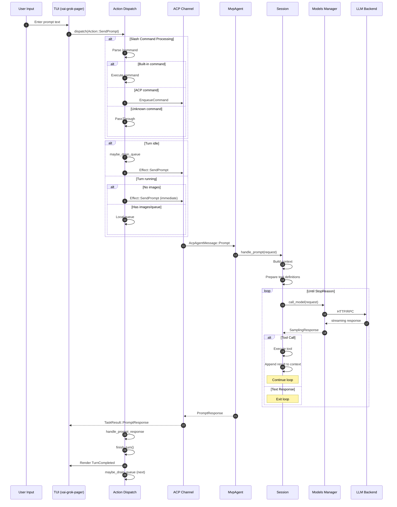
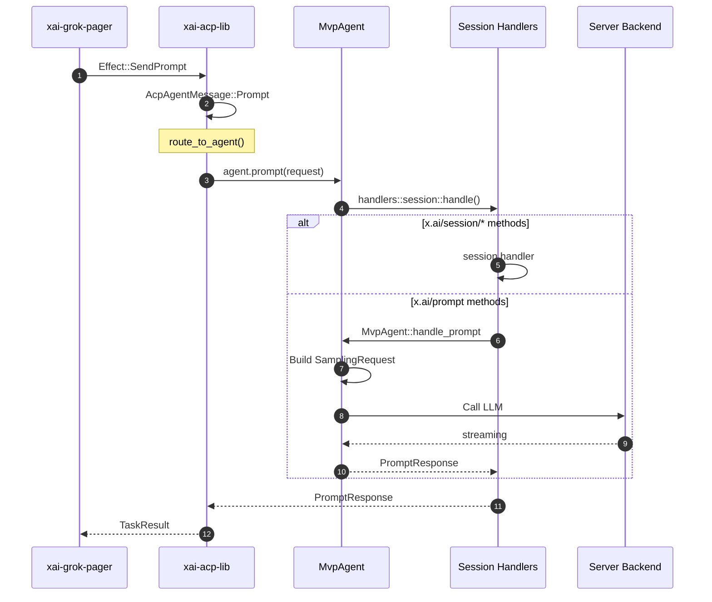
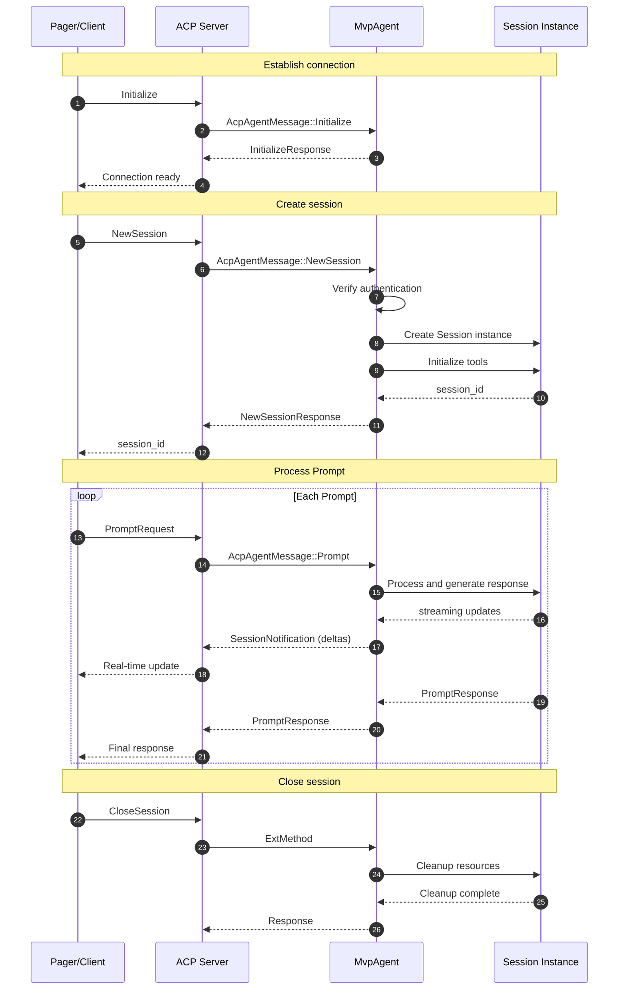
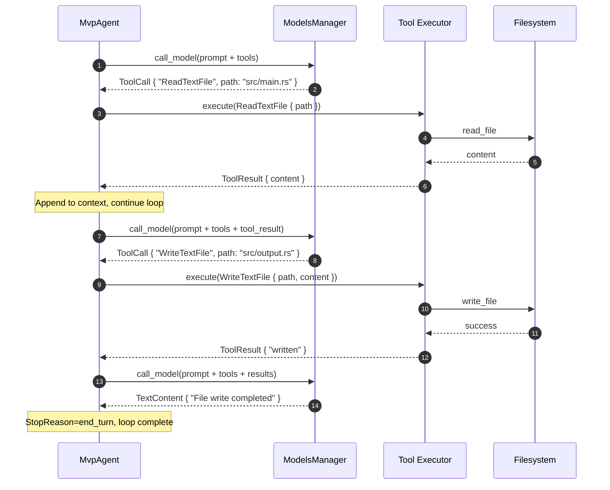

# Grok Build Complete Request Call Chain Analysis

## Table of Contents

- [1. Input Entry Points](#1-input-entry-points)
- [2. Request Routing](#2-request-routing)
- [3. Agent Processing](#3-agent-processing)
- [4. Model Invocation](#4-model-invocation)
- [5. Response Generation](#5-response-generation)
- [6. Sequence Diagrams](#6-sequence-diagrams)

---

## 1. Input Entry Points

Grok Build supports multiple input methods to initiate requests:

### 1.1 TUI Interactive Entry Points

| Entry Point | Source Location | Description |
|-------------|-----------------|-------------|
| Prompt Input | `xai-grok-pager/src/app/agent_view/prompt.rs` | User enters text in terminal |
| Slash Commands | `xai-grok-pager/src/slash/mod.rs` | Built-in commands starting with `/` |
| Hotkey Bindings | `xai-grok-pager/src/input/*.rs` | Keyboard shortcuts like Ctrl+C, Ctrl+Z |
| Follow-up Chips | `xai-grok-pager/src/app/agent_view/` | Server-suggested quick replies |
| Bash Commands | `xai-grok-pager/src/app/dispatch/prompt.rs` | Direct commands starting with `!` |

### 1.2 Startup Argument Entry Points

```rust
// xai-grok-pager-bin/src/main.rs
// Pass prompt directly at startup
grok "explain this code"
grok --resume <session_id>
grok --chat "interactive prompt"
```

### 1.3 ACP Protocol Entry Points

Receiving remote requests via Agent Client Protocol (ACP):

| Message Type | Source Location | Description |
|--------------|-----------------|-------------|
| `ExtRequest` | `xai-acp-lib/src/message.rs` | Extended method request |
| `ExtNotification` | `xai-acp-lib/src/message.rs` | Extended notification |
| `SessionNotification` | `xai-acp-lib/src/message.rs` | Session update notification |

---

## 2. Request Routing

### 2.1 TUI Event Dispatch

```
┌─────────────────────────────────────────────────────────────┐
│                     Input Handling                          │
│  xai-grok-pager/src/app/input/                             │
└─────────────────────────────────────────────────────────────┘
                              │
                              ▼
┌─────────────────────────────────────────────────────────────┐
│                   InputEvent → Action                       │
│  xai-grok-pager/src/app/input/                             │
│  - KeyEvent → Action::SendPrompt                           │
│  - MouseEvent → Action::*                                  │
│  - ResizeEvent → Action::*                                 │
└─────────────────────────────────────────────────────────────┘
                              │
                              ▼
┌─────────────────────────────────────────────────────────────┐
│                      Action Dispatch                        │
│  xai-grok-pager/src/app/dispatch/router.rs                 │
│                                                             │
│  pub fn dispatch(action: Action, app: &mut AppView)        │
└─────────────────────────────────────────────────────────────┘
```

### 2.2 Core Routing Logic

**Key File**: `xai-grok-pager/src/app/dispatch/router.rs`

```rust
pub(crate) fn dispatch(action: Action, app: &mut AppView) -> Vec<Effect> {
    match action {
        // Session management
        Action::NewSession => dispatch_new_session(app),
        Action::LoadSession(id, cwd, chat) => dispatch_load_session(...),
        Action::ExitSession => dispatch_exit_session(app),
        
        // Prompt processing core path
        Action::SendPrompt(text) => dispatch_send_prompt(app, text),
        Action::SubmitFollowUp(text) => dispatch_send_prompt_inner(...),
        Action::SendBashCommand(cmd) => dispatch_send_bash_command(...),
        
        // Interactive commands
        Action::Interject { text, images } => dispatch_interject(...),
        Action::SendPromptNow { text, images } => dispatch_send_prompt_now(...),
        
        // ...
    }
}
```

### 2.3 Prompt Routing Decision

```
dispatch_send_prompt(text)
         │
         ├──► Reconnect pending? ──► Show Toast
         │
         ├──► Project selector needed? ──► Open project question dialog
         │
         ├──► Starts with `/`? ──► Slash command parsing
         │         │
         │         ├──► Built-in command ──► Execute CommandResult
         │         ├──► ACP command ──► EnqueueCommand
         │         └──► Unknown command ──► PassThrough to model
         │
         ├──► Exit alias? (exit/quit/:q) ──► Exit session
         │
         ├──► Turn running + images? ──► Local queue
         │
         ├──► Turn running + no images? ──► Immediate server send
         │                          └──► Effect::SendPrompt
         │
         └──► Idle state? ──► Local queue + maybe_drain_queue
```

### 2.4 Effect Types

**Key File**: `xai-grok-pager/src/app/actions.rs`

```rust
pub enum Effect {
    // Core Prompt effects
    SendPrompt {
        agent_id: AgentId,
        session_id: acp::SessionId,
        text: String,
        prompt_id: String,
        skill_token_ranges: Vec<Range<usize>>,
    },
    SendBashCommand { agent_id, session_id, command, prompt_id },
    
    // Session management effects
    NewSession { chat_mode: bool },
    LoadSession { session_id, cwd, chat_mode },
    
    // Model interaction effects
    SwitchModel { agent_id, session_id, model_id, effort },
    FetchPromptSuggestion { agent_id, generation, model, session_id },
    
    // MCP/Tool effects
    UpsertMcpServer { agent_id, session_id, name, config },
    HooksAction { agent_id, session_id, action },
    
    // ...
}
```

---

## 3. Agent Processing

### 3.1 ACP Agent Implementation

**Key File**: `xai-grok-shell/src/agent/mvp_agent/acp_agent.rs`

```rust
#[async_trait::async_trait(?Send)]
impl acp::Agent for MvpAgent {
    async fn initialize(&self, arguments: acp::InitializeRequest) 
        -> Result<acp::InitializeResponse, acp::Error> { ... }
    
    async fn new_session(&self, request: acp::NewSessionRequest) 
        -> Result<acp::NewSessionResponse, acp::Error> { ... }
    
    async fn load_session(&self, request: acp::LoadSessionRequest) 
        -> Result<acp::LoadSessionResponse, acp::Error> { ... }
    
    async fn prompt(&self, request: acp::PromptRequest) 
        -> Result<acp::PromptResponse, acp::Error> { ... }
    
    async fn cancel(&self, request: acp::CancelNotification) 
        -> Result<(), acp::Error> { ... }
    
    async fn set_session_mode(&self, request: acp::SetSessionModeRequest) 
        -> Result<acp::SetSessionModeResponse, acp::Error> { ... }
    
    async fn ext_method(&self, request: acp::ExtRequest) 
        -> Result<acp::ExtResponse, acp::Error> { ... }
    
    async fn ext_notification(&self, request: acp::ExtNotification) 
        -> Result<(), acp::Error> { ... }
}
```

### 3.2 ACP Message Definitions

**Key File**: `xai-acp-lib/src/message.rs`

```rust
// Messages received by Agent
pub enum AcpAgentMessage {
    Initialize(AcpArgs<acp::InitializeRequest>),
    Authenticate(AcpArgs<acp::AuthenticateRequest>),
    NewSession(AcpArgs<acp::NewSessionRequest>),
    LoadSession(AcpArgs<acp::LoadSessionRequest>),
    SetSessionMode(AcpArgs<acp::SetSessionModeRequest>),
    Prompt(AcpArgs<acp::PromptRequest>),        // Core: process user prompt
    Cancel(AcpArgs<acp::CancelNotification>),
    ExtMethod(AcpArgs<acp::ExtRequest>),
    ExtNotification(AcpArgs<acp::ExtNotification>),
    SetSessionModel(AcpArgs<acp::SetSessionModelRequest>),
}
```

### 3.3 Session Management

**Key File**: `xai-grok-shell/src/agent/mvp_agent/session_lifecycle.rs`

```rust
pub struct MvpAgent {
    pub sessions: Arc<RefCell<HashMap<acp::SessionId, Arc<Session>>>>,
    pub models_manager: Arc<ModelsManager>,
    pub auth_manager: Arc<AuthManager>,
    // ...
}

impl MvpAgent {
    pub async fn create_session(&self, request: &NewSessionRequest) -> Result<SessionId> {
        // 1. Verify authentication
        // 2. Create Session instance
        // 3. Initialize tool system
        // 4. Return session_id
    }
    
    pub async fn handle_prompt(&self, session: &Session, request: &PromptRequest) 
        -> Result<PromptResponse> {
        // Core prompt handling logic
    }
}
```

### 3.4 Session State Machine

```
┌──────────────────────────────────────────────────────────────┐
│                      Session State Machine                   │
└──────────────────────────────────────────────────────────────┘

Created ──► Active ──► TurnRunning ──► TurnCancelling ──► Active
                │            │               │
                │            ▼               ▼
                │       (model call)    (cancel complete)
                │
                ▼
            Closing ──► Closed
```

---

## 4. Model Invocation

### 4.1 Models Manager

**Key File**: `xai-grok-shell/src/agent/models.rs`

```rust
pub struct ModelsManager {
    pub config: ModelConfig,
    pub cache: ModelCache,
    pub sampling: SamplingManager,
}

impl ModelsManager {
    pub async fn select_model(&self, session: &Session, model_id: Option<&str>) 
        -> Result<ModelHandle> {
        // 1. Parse model request
        // 2. Check availability/quota
        // 3. Return model handle
    }
    
    pub async fn call_model(&self, request: &SamplingRequest) 
        -> Result<SamplingResponse> {
        // Call backend model API
    }
}
```

### 4.2 Sampling Request Construction

**Key File**: `xai-grok-shell/src/sampling/`

```rust
pub struct SamplingRequest {
    pub model: ModelId,
    pub system_prompt: String,
    pub messages: Vec<Message>,
    pub tools: Vec<ToolDefinition>,
    pub temperature: Option<f32>,
    pub max_tokens: Option<u32>,
    pub reasoning_effort: Option<ReasoningEffort>,
}

pub struct SamplingResponse {
    pub content: Vec<ContentBlock>,
    pub stop_reason: StopReason,
    pub usage: Usage,
    pub model: String,
}
```

### 4.3 Context Management

**Key File**: `xai-grok-chat-state/src/`

```rust
pub struct ConversationTranscript {
    pub messages: Vec<Message>,
    pub compaction_state: CompactionState,
}

impl ConversationTranscript {
    pub fn build_context(&self, max_tokens: u64) -> CompactedContext {
        // 1. Calculate current token count
        // 2. Determine if compaction is needed
        // 3. Build summary
        // 4. Return compacted context
    }
}
```

### 4.4 Tool Call Flow

```
User Prompt
     │
     ▼
┌─────────────────────────────────────────────────────────────┐
│                    Model Inference                          │
└─────────────────────────────────────────────────────────────┘
     │
     ▼
┌─────────────────────────────────────────────────────────────┐
│                Tool Call Decision                           │
│  model.response.content.iter().find(|b| matches!(b,       │
│      ContentBlock::ToolUse(_)))                            │
└─────────────────────────────────────────────────────────────┘
     │
     ├──► No Tool Call ──► Return final response
     │
     └──► Has Tool Call ──► Execute tool
                        │
                        ├──► ReadTextFile ──► Read file
                        ├──► WriteTextFile ──► Write file
                        ├──► TerminalCreate ──► Create terminal
                        ├──► Bash ──► Execute command
                        └──► MCP ──► MCP server call
                              │
                              ▼
                        ┌─────────────────────────────────┐
                        │  Append tool result to context  │
                        └─────────────────────────────────┘
                              │
                              ▼
                        ┌─────────────────────────────────┐
                        │  Loop: Call model again         │
                        └─────────────────────────────────┘
```

---

## 5. Response Generation

### 5.1 Turn Completion Handling

**Key File**: `xai-grok-pager/src/app/dispatch/prompt.rs`

```rust
pub(super) fn handle_prompt_response(
    app: &mut AppView,
    agent_id: AgentId,
    result: Result<acp::PromptResponse, String>,
    http_status: Option<u16>,
    prompt_id: Option<String>,
) -> Vec<Effect> {
    // 1. Verify prompt_id match
    // 2. Handle cancel/error state
    // 3. Clear in_flight_prompt
    // 4. finish_turn(): reset state
    // 5. Push TurnCompleted/TurnFailed events
    // 6. Handle quota limit/auth failure
    // 7. Trigger queue draining
}
```

### 5.2 Streaming Update Handling

**Key File**: `xai-grok-pager/src/app/acp_handler/`

```rust
// Streaming delta routing
pub fn handle_session_notification(
    app: &mut AppView,
    agent_id: AgentId,
    update: acp::SessionUpdate,
) -> Vec<Effect> {
    match update {
        SessionUpdate::ContentBlock_delta(d) => {
            // Incremental text update
            agent.scrollback.append_delta(delta);
        }
        SessionUpdate::ContentBlock_start(b) => {
            // Start new content block
        }
        SessionUpdate::ToolUse(t) => {
            // Tool call started
        }
        SessionUpdate::ToolResult(r) => {
            // Tool result arrived
        }
        SessionUpdate::TurnComplete(c) => {
            // Turn completed
        }
        // ...
    }
}
```

### 5.3 Scrollback Block Rendering

**Key File**: `xai-grok-pager/src/scrollback/block.rs`

```rust
pub enum RenderBlock {
    UserPrompt { text: String, images: Vec<PastedImage> },
    AssistantMessage { content: Vec<ContentBlock>, thinking: Option<Thinking> },
    ToolUse { tool: String, input: serde_json::Value, output: Option<String> },
    BashOutput { exit_code: i32, stdout: String, stderr: String },
    SessionEvent(SessionEvent),
    System(String),
    Thinking { blocks: Vec<ThinkingBlock> },
    // ...
}
```

---

## 6. Sequence Diagrams

### 6.1 Complete Prompt Processing Flow



### 6.2 ACP Message Routing



### 6.3 Session Lifecycle



### 6.4 Tool Call Loop



---

## Appendix: Core File Index

| Feature Module | File Path |
|----------------|-----------|
| TUI Entry | `xai-grok-pager/src/app/app_view.rs` |
| Action Routing | `xai-grok-pager/src/app/dispatch/router.rs` |
| Prompt Processing | `xai-grok-pager/src/app/dispatch/prompt.rs` |
| ACP Definitions | `xai-acp-lib/src/message.rs` |
| Agent Implementation | `xai-grok-shell/src/agent/mvp_agent/acp_agent.rs` |
| Session Handling | `xai-grok-shell/src/agent/mvp_agent/session_lifecycle.rs` |
| Models Management | `xai-grok-shell/src/agent/models.rs` |
| Session State | `xai-grok-pager/src/app/agent.rs` |
| Streaming Processing | `xai-grok-pager/src/app/acp_handler/` |
| Scrollback Block | `xai-grok-pager/src/scrollback/block.rs` |